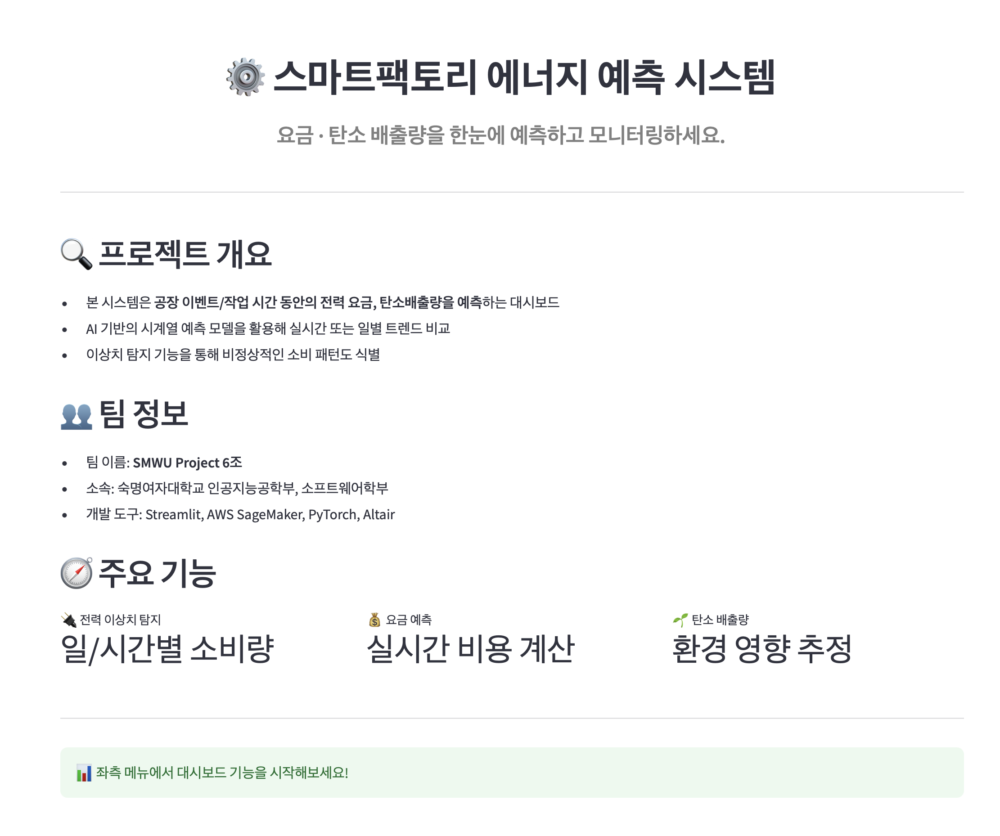
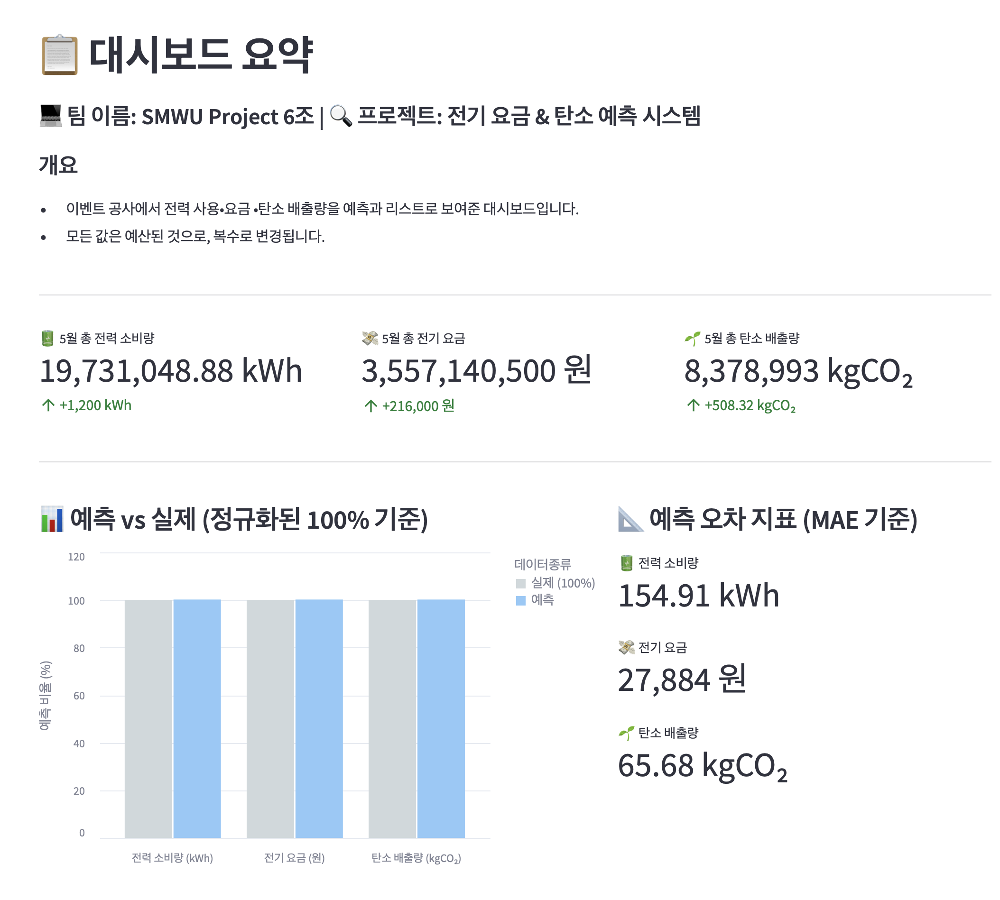

# ⚙️ 스마트팩토리 에너지 예측 대시보드

> **전력 소비량 · 요금 · 탄소 배출량을 한눈에 예측하고 모니터링**

---

## 📌 프로젝트 개요

본 프로젝트는 공장 이벤트/작업 시점에 발생하는 **전력 소비량**, **전기 요금**, **탄소 배출량**을 예측하여 시각적으로 제공하는 **AI 기반 에너지 관리 대시보드**입니다.

- 시계열 예측 모델 (LSTM, RNN, ARIMA 등)을 사용하여 **실시간 추이 예측** 및 과거/미래 비교
- 이상치 탐지 기능을 통해 **비정상적인 소비 패턴 식별** 및 경고
- 예측 지표는 **전력(kWh), 요금(₩), 탄소 배출량(kgCO₂)**로 구성되어 있으며, MAE 기준의 정확도를 사용

---

## 🧠 수행 과제

### 1. 전력 소비 기반 예측 모델 개발
- 예측 대상: 전력 소비량, 전기 요금, 탄소 배출량  
- 예측 기준:  
  - 전기요금 = 180원 / kWh  
  - 탄소배출량 = 0.424 kgCO₂ / kWh

### 2. 이상치 탐지 시스템
- ARIMA 기반 1차 예측 오차 기반 이상 판단
- LSTM 및 시각 분석 기반 검증
- 결과는 시각적으로 표시됨 (그래프/경고 박스 등)

### 3. Streamlit 기반 대시보드 구현
- 실시간 예측 값 시각화
- 이상치 탐지 결과 확인
- 예측 정확도(MAE 기준) 표시
- 요약 리포트 및 필터 제공 (날짜, 설비)

---

## 🖥️ 주요 기능

| 기능 | 설명 |
|------|------|
| ⏱️ 실시간 소비량 예측 | 시계열 기반 소비량 예측 |
| 💰 전기요금 계산 | 단가 기준 실시간 요금 변환 |
| 🌿 탄소배출량 산출 | 친환경 지표 제공 |
| 🔎 이상치 탐지 | 비정상 소비 패턴 시각화 및 경고 표시 |

---

## 📊 대시보드 예시

<p align="center">
  
  
</p>
---

## 🧑‍💻 팀 정보

| 이름 | 역할 | 담당 내용 |
|------|------|------------|
| 김예은 | LSTM 모델링 | LSTM 예측 모델 개발, UI 설계 |
| 조해수 | ARIMA 분석 | 전력량 예측, 이상치 탐지 |
| 김성현 | 배포 & 설계 | AWS 서버 배포, Streamlit UI |
| 임수연 | 배포 & 설계 | AWS 서버 배포, Streamlit UI |

**소속:** 숙명여자대학교 AI공학부 / 소프트웨어학부  
**팀명:** SMWU Project 6조  
**개발 환경:** Streamlit, AWS SageMaker, PyTorch, Altair


---

## 🔧 기술 스택

- **Frontend**: `Streamlit`, `Altair`
- **Backend**: `PyTorch`, `ARIMA`, `darts`
- **ML 환경**: `AWS SageMaker Notebook`, `SageMaker Endpoint`
- **모델 저장/호출**: `.pt`, `.pkl` 형식

---

## 🚀 실행 방법

```bash
# 저장소 클론
git clone https://github.com/Ssunsooo/AWS-project

# 가상환경 설정
python -m venv venv
source venv/bin/activate

# 필수 라이브러리 설치
pip install -r requirements.txt

# Streamlit 앱 실행
streamlit run app.py
